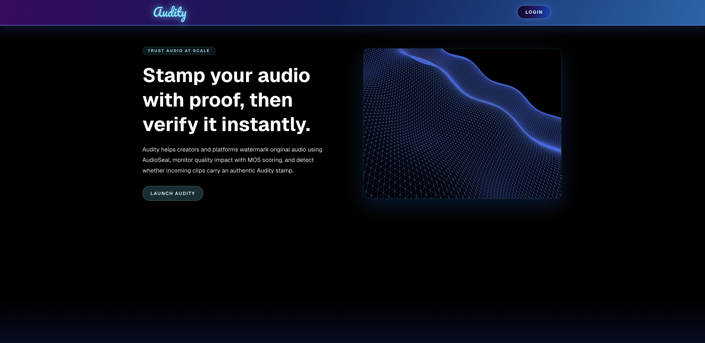

# Audity

## Table of Contents
1. [Why I Built This](#why-i-built-this)
2. [Features](#features)
3. [Project Structure](#project-structure)
4. [Screenshots](#screenshots)
5. [What You Need First](#what-you-need-first)
6. [Supabase Setup](#supabase-setup)
7. [Environment Files](#environment-files)
8. [Local Development](#local-development)
9. [How The App Works](#how-the-app-works)
10. [Deployment](#deployment)

## Why I Built This
In an era where AI can clone a human voice with just seconds of audio, the barrier to creating convincing misinformation has never been lower. I built **Audity** to combat AI negativity by shifting the paradigm from *reactive detection* to *proactive provenance*.

The primary mission of this app is to ensure that **enforce integrity in the domain of audio.** By utilizing robust watermarking (AudioSeal), Audity provides a "digital poison pill" for unauthorized generative use. 

This makes the world more resilient to negative AI use by:
- **Watermark Bleed:** The embedded watermarks are designed to be resilient enough to "bleed" onto deepfake models. If a model uses your watermarked audio for training or generation, the resulting synthetic output can still carry traces of the original watermark, making the fraud detectable.
- **Accountability for Deepfakes:** By lowering the barrier to watermarking, we create a world where "unsigned" audio is treated with skepticism. If a deepfake is generated using your voice, the lack of a valid watermark—or the presence of a "bleeding" one—acts as definitive proof of manipulation.
- **Democratizing Protection:** Professional-grade protection is often locked behind enterprise paywalls. Audity makes these tools free and accessible to the independent creators, journalists, and individuals who are most vulnerable to voice theft and AI-generated impersonation.

## Features
Audity is a full-stack audio authenticity app, made using NextJS/TS, FastAPI, and Supabase. It lets a signed-in user:
- Watermark an uploaded audio file with an AudioSeal-based backend
- Optionally score the audio with MOS data
- Detect whether a file appears to contain an AudioSeal watermark
- Browse their own uploads on the dashboard
- Browse public uploads in the library

## Project Structure
The project is split into two apps:
- `frontend/` is a Next.js app with Supabase auth and the main UI
- `backend/` is a FastAPI service that handles watermarking and detection

## Screenshots
These images show the main user flow in the app:

### Landing Page


### Watermark Page


### Detect Page


### Dashboard


### Library


## What You Need First
This repository does not ship with a ready-made Supabase project. You must create your own Supabase project and connect both apps to it.

You will also need to create the required environment files yourself:
- `frontend/.env.local`
- `backend/backend.env`

The app expects those files to contain your own Supabase URLs and keys, not the example values that were used during development.

## Supabase Setup
Create a new Supabase project and configure these pieces:
- Authentication for username/password sign-up and sign-in
- A storage bucket named `audios`
- A `Users` table for app usernames
- An `Audios` table for uploaded audio metadata

The frontend reads and writes audio records through Supabase, and the backend uploads watermarked files into Supabase storage.

Typical `Audios` fields used by the app:
- `id`
- `user_id`
- `name`
- `file_path`
- `mos`
- `public`
- `created_at`

Typical `Users` fields used by the app:
- `id`
- `username`
- `password`

## Environment Files

### `frontend/.env.local`

```env
NEXT_PUBLIC_SUPABASE_URL="https://your-project.supabase.co"
NEXT_PUBLIC_SUPABASE_ANON_KEY="your-supabase-anon-key"
NEXT_PUBLIC_SUPABASE_AUDIO_BUCKET="audios"
NEXT_PUBLIC_API_BASE_URL="http://localhost:8000"
NEXT_PUBLIC_API_URL="http://localhost:8000"
```

Note: the current frontend uses `NEXT_PUBLIC_API_BASE_URL` on the watermark and detect pages, and `NEXT_PUBLIC_API_URL` on the dashboard. Set both to the same backend URL unless you normalize them in code.

### `backend/backend.env`

```env
SUPABASE_URL="https://your-project.supabase.co"
SUPABASE_SERVICE_ROLE_KEY="your-supabase-service-role-or-secret-key"
SUPABASE_AUDIO_BUCKET="audios"
CORS_ORIGINS="http://localhost:3000"
AUDIOSEAL_DEVICE="cpu"
```

The backend uses your Supabase service-role or secret key to upload files into storage. Keep that key on the backend only.

## Local Development

### Backend

From the `backend/` folder:

```bash
python -m venv venv
source venv/bin/activate
pip install -r requirements.txt
uvicorn main:app --reload --port 8000
```

### Frontend

From the `frontend/` folder:

```bash
npm install
npm run dev
```

Then open `http://localhost:3000`.

## How The App Works

1. Register or log in through the frontend.
2. Upload audio on the watermark page.
3. The backend watermarks the file and uploads it to Supabase storage.
4. The frontend stores metadata in the `Audios` table.
5. Dashboard shows your uploads, MOS scores when available, and download/delete controls.
6. Library shows public audios that other users have marked public.
7. Detect uploads a file to the FastAPI `/detect` route and returns the AudioSeal result.

## Deployment

Deploy the frontend and backend separately.

### 1. Deploy Supabase First

Before deploying either app, create and configure your Supabase project:

- create the `audios` bucket
- create the required tables
- set up any row-level security or policies you want to use
- add your production frontend URL to the Supabase auth redirect settings

### 2. Deploy the Backend

Host the FastAPI app on a Python-capable service that can install `torch`, `torchaudio`, and `audioseal`.

Typical deployment steps:

```bash
cd backend
pip install -r requirements.txt
uvicorn main:app --host 0.0.0.0 --port 8000
```

Set the production values in `backend/backend.env`, especially:

- `SUPABASE_URL`
- `SUPABASE_SERVICE_ROLE_KEY`
- `CORS_ORIGINS`

Make sure `CORS_ORIGINS` includes your deployed frontend domain.

### 3. Deploy the Frontend

Deploy the Next.js app to a static/serverless host such as Vercel or another Node.js platform.

Build command:

```bash
cd frontend
npm install
npm run build
```

Start command:

```bash
npm run start
```

Set production frontend environment variables to point at:

- your Supabase project
- your deployed backend URL
- your Supabase `audios` bucket

## Notes

- The backend requires working TLS certificate access for package/model downloads.
- AudioSeal inference can be compute-heavy, so CPU-only hosting may be slower for large files.
- Keep your Supabase service-role or secret key out of the frontend.
